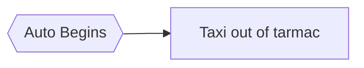
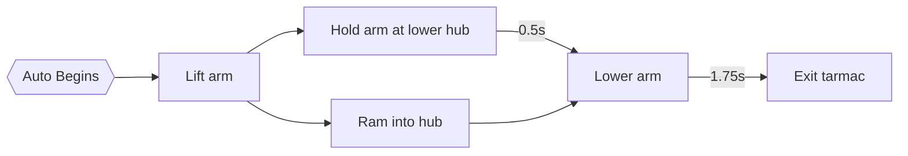

# Stealth Tigers 3164

A complete re-write of the 2021-2022 season's robot code.
Designed to run on team 3164's bot and teach new members the basics of code.

## Driving

The robot can be driven with two Xbox controllers. The first controller is the Driver, which drives the robot.
The second controller is the Operator, which manipulates the arm and winch.

### Driver
Left Stick Y &#8594; Drive forwards/backwards\
Right Stick X &#8594; Turn\
Left Bumper and Right Bumper (Hold) &#8594; Drive slowly

### Operator
Left Stick Y &#8594; Arm power\
D-pad Up &#8594; Wind winch\
D-pad Down &#8594; Unwind winch

## Autonomous Routines

Auto routines run during the 15 seconds of the robot game. During these 15 seconds, the robot moves without driver control,
scoring points. Before the match starts, the driver can pick which routine to run using SmartDashboard or Shuffleboard.


#### During the `Exit Tarmac` routine, the robot taxis (drives backwards) out of the tarmac, scoring 2 points.




#### During the `1-Ball Preloaded` routine, the robot drops a cargo into the lower goal before taxiing, scoring 4 total points.  



## Setup

```bash
# Install Python dependencies
pip install -r requirements.txt

# Setup pre-commit hooks
pre-commit install --install-hooks
```

This installs `robotpy` and `black`, the code formatter.
Check out the [Black docs](https://black.readthedocs.io/en/stable/integrations/editors.html) to integrate with your code editor.

Additionally, it installs pre-commit hooks, which run before every Git commit. The hooks in this repo run `black` and
automatically fix formatting errors.

## Development

Team 3164's robot runs on RobotPy! The getting started guide can be found [here](https://robotpy.readthedocs.io/en/stable/guide/index.html).

```bash
# Run code in a simulator
python -m robot sim
```

```bash
# Deploy the code to a real robot
python -m robot deploy
```

## Code Overview

This codebase is written using the [Command-Based design pattern](https://docs.wpilib.org/en/stable/docs/software/commandbased/what-is-command-based.html).
Command-based places an emphasis on separating *how* the robot does something from *what* the robot ought to do and
minimizes the amount of iteration-by-iteration code that must be written.

### `robot`
The module that gets run first. Initializes the `RobotContainer` and `dashboard` module.
The iteration-by-iteration (periodic) code is also here, but most of the robot logic is handed off to the
`CommandScheduler`, which is created by subclassing `TimedCommandRobot`.
The `CommandScheduler` automatically runs Subsystem and Command code.

### `container`
Contains the `RobotCotainer`. Initializes user input devices (joysticks), Subsystems, and Commands.


Subsystems represent physical systems on the robot.
Each subsystem contains the motors, sensors, and methods needed to interact with it, as well as simple Commands.


Commands run code and can be sequenced in different ways (i.e. sequential or parallel).
Each Subsystem runs a Command by default, and Commands can be strung together to create routines in autonomous.

### `subsystems`
A module containing Subsystems. Each Subsystem has its own module that contains the Subsystem class and any extra
functions or logic specific to it.

### `physics`
Defines a simulated robot that mirrors the real one. Needed for the simulation to run.

### `map`
Robot constants that include ports, speeds, PID values, etc. Anything "magic numbers" should be defined here.

### `commands`
Contains abstract Command definitions that can be used in different command groupings.
Does **not** include Subsystem-specific Commands; those are defined in `subsystems`.

### `replay`
A pair of Commands used to record a stream of values (e.g. joystick inputs or motor speeds) and play them back later.
This can be useful for getting quick and dirty autonomous routines up and running.

### `dashboard`
Used to automatically update values on the robot dashboard (i.e. SmartDashboard).

### `oi`
OI stands for operator input. This module contains control schemes (e.g. Xbox controller, flight stick) for teleop.